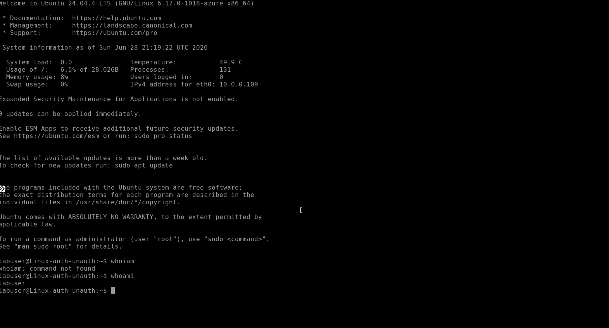
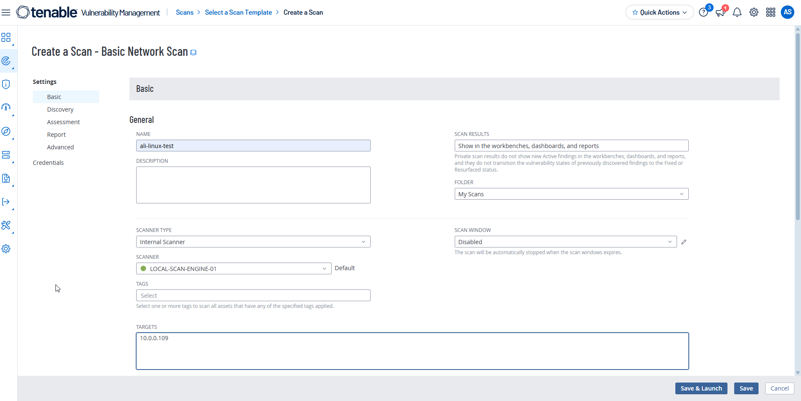
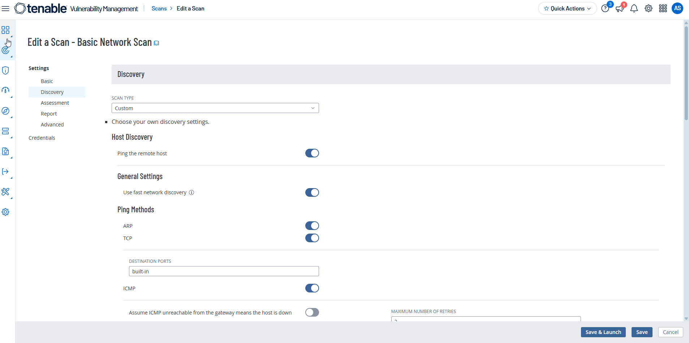
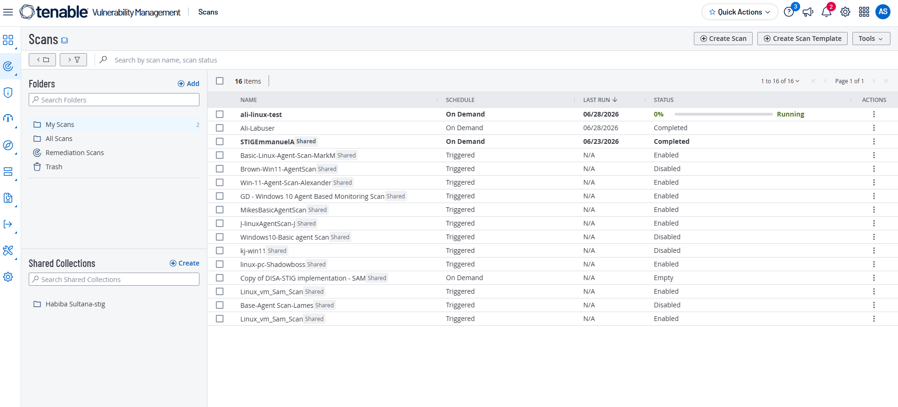
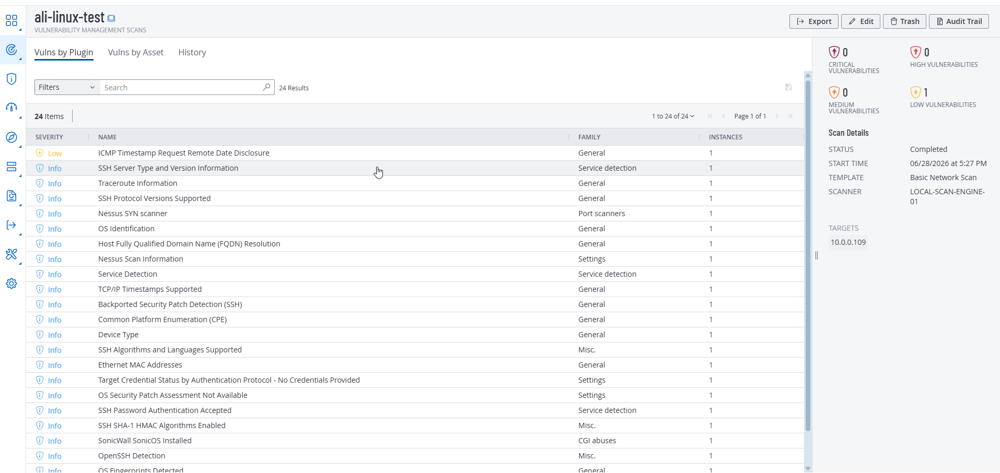
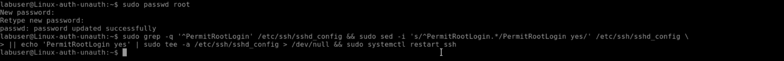
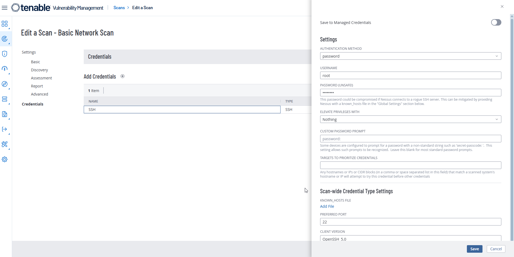
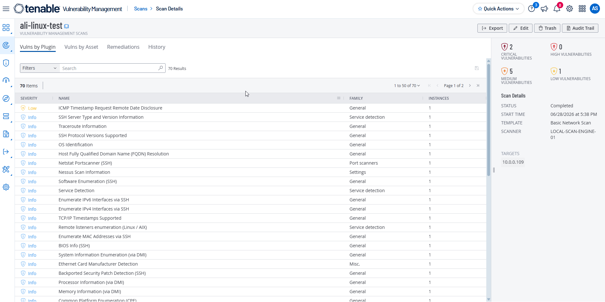

# Tenable Vulnerability Assessment
## Linux (Ubuntu 24) - Authenticated vs. Unauthenticated Scan

## Objective

The objective of this lab is to perform both **Unauthenticated** and **Authenticated** vulnerability scans against an Ubuntu 24 Virtual Machine using **Tenable Vulnerability Management**, compare the scan results, and understand the advantages of authenticated vulnerability assessments.

---

# Lab Environment

| Component | Details |
|----------|---------|
| Operating System | Ubuntu 24 LTS |
| Scanner | Tenable Vulnerability Management |
| Scanner Type | Internal Scanner |
| Scan Type | Basic Network Scan |
| Target | Linux Virtual Machine |
| Target IP | `10.0.0.109` (Private IP) |

---

# Prerequisites

Before starting the assessment, ensure:

- Ubuntu 24 Virtual Machine is deployed.
- Azure Bastion is configured.
- Tenable Scanner is online.
- Network connectivity exists between the scanner and the target VM.

---

# Part 1: Deploy the Linux Virtual Machine

## Step 1: Create an Ubuntu 24 Virtual Machine

Create a new Ubuntu 24 LTS Virtual Machine in Azure.

During VM creation:

- Select **Password** as the authentication type.
- Create a username and password.
- Save the credentials, as they will be required for the authenticated scan.

> **Figure 1:** Ubuntu 24 Virtual Machine Configuration



---

## Step 2: Verify SSH Connectivity

Connect to the Ubuntu VM using **Azure Bastion**.

After connecting, verify that SSH access is working properly.

---

# Part 2: Perform an Unauthenticated Scan

## Step 3: Create a Basic Network Scan

In the Tenable portal:

```
Scans
→ Create Scan
→ Basic Network Scan
```

Configure the scan using the following settings:

| Setting | Value |
|----------|-------|
| Name | Linux Unauthenticated Scan |
| Scanner | Internal Scanner |
| Scan Engine | Local Scan Engine |
| Target | 10.0.0.109 |

> **Figure 2:** Basic Network Scan Configuration



---

## Step 4: Configure Discovery Settings

Navigate to:

```
Discovery
```

Configure the following options:

- **Scan Type:** Custom
- Enable **Ping the Remote Host**

Click **Save**.

> **Figure 3:** Discovery Settings



---

## Step 5: Launch the Scan

Launch the scan and wait for it to complete.

> **Figure 4:** Launching the scan 


### Scan Duration

- **Unauthenticated Scan:** Approximately **5 minutes**

After completion:

- Export the scan report.
- Review detected vulnerabilities.
- Observe CVSS scores and severity ratings.

> **Figure 5:** Unauthenticated Scan Results



---

# Part 3: Configure the Linux VM for Authenticated Scanning

Before running an authenticated scan, enable the **root** account and allow SSH login.

---

## Step 6: Enable the Root Account

Connect to the Ubuntu VM using Azure Bastion or SSH.

Run the following command:

```bash
sudo passwd root
```

When prompted:

- Enter a password for the **root** account.
- Confirm the password.

> **Figure 6:** Setting the Root Password



---

## Step 7: Enable Root Login over SSH

Execute the following command to allow root login through SSH and restart the SSH service.

```bash
sudo grep -q '^PermitRootLogin' /etc/ssh/sshd_config && sudo sed -i 's/^PermitRootLogin.*/PermitRootLogin yes/' /etc/ssh/sshd_config \
|| echo 'PermitRootLogin yes' | sudo tee -a /etc/ssh/sshd_config > /dev/null && sudo systemctl restart ssh
```

This command:

- Enables root SSH login.
- Updates the SSH configuration.
- Restarts the SSH service to apply the changes.

> **Figure 7:** Enabling Root Login via SSH


---

# Part 4: Perform an Authenticated Scan

## Step 8: Configure SSH Credentials

Edit the existing scan.

Navigate to:

```
Credentials
→ Add Credentials
→ Host
→ SSH
```

Configure the following settings:

| Setting | Value |
|----------|-------|
| Authentication Method | Password |
| Username | root |
| Password | Root Password |

Save the configuration.

> **Figure 8:** SSH Credential Configuration



---

## Step 9: Launch the Authenticated Scan

Run the scan again.

### Scan Duration

- **Authenticated Scan:** Approximately **5 minutes**

After completion:

- Export the report.
- Review additional findings.
- Compare the results with the unauthenticated scan.

> **Figure 9:** Authenticated Scan Results



---

# Part 5: Compare Scan Results

Compare both exported reports.

| Feature | Unauthenticated Scan | Authenticated Scan |
|----------|----------------------|--------------------|
| SSH Login | ❌ No | ✅ Yes |
| Missing Packages | Limited | Comprehensive |
| Configuration Audit | ❌ | ✅ |
| Installed Software Detection | ❌ | ✅ |
| Vulnerability Coverage | Limited | Extensive |
| Scan Duration | 5 Minutes | 5 Minutes |

---

# Observations

## Unauthenticated Scan

- Simulates an external attacker.
- Identifies vulnerabilities visible over the network.
- Does not inspect the operating system internally.
- Cannot evaluate installed packages or local configurations.

---

## Authenticated Scan

- Logs into the operating system using SSH credentials.
- Detects missing security updates and installed software vulnerabilities.
- Performs configuration auditing.
- Provides more accurate vulnerability detection with fewer false positives.

---

# Conclusion

This lab demonstrated the differences between unauthenticated and authenticated vulnerability scanning on an Ubuntu 24 virtual machine.

While the unauthenticated scan identified externally accessible vulnerabilities, the authenticated scan provided significantly deeper insight by inspecting the operating system using SSH credentials. It identified additional vulnerabilities, software package issues, and configuration weaknesses that were not visible during the unauthenticated assessment.

Authenticated scanning is recommended for enterprise vulnerability management because it provides a more complete view of a system's security posture and enables more effective remediation planning.
````
